# 周期提醒APP - 完整业务流程设计

# 🔄 周期提醒APP - 完整业务流程设计

> **基于数据库设计，梳理的完整业务流程和用户旅程**
> 

---

## 📱 核心业务流程概览

### **用户生命周期流程**

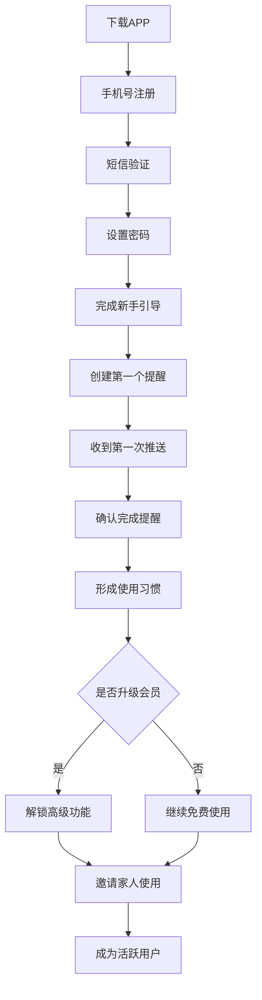

---

## 🔐 流程1：用户注册与认证

### **注册流程**

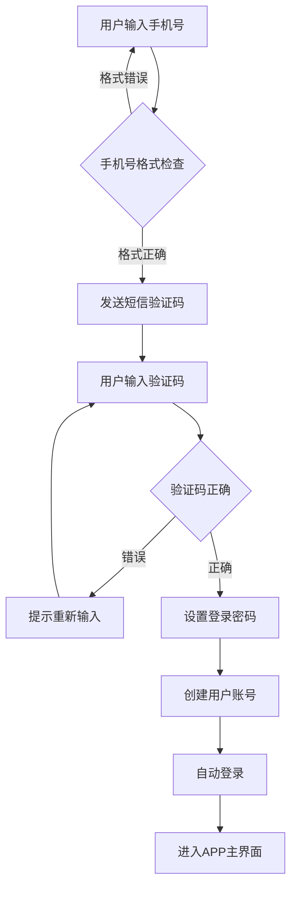

**涉及数据表：**

- `users` - 存储用户基本信息
- `sms_verification` - 短信验证记录
- `user_sessions` - 会话管理

**业务规则：**

- 手机号唯一性检查
- 验证码5分钟有效期
- 密码强度要求（8位以上，包含数字字母）
- 自动清理过期验证码

---

## ➕ 流程2：创建提醒（核心流程）

### **A. 基于模板创建**

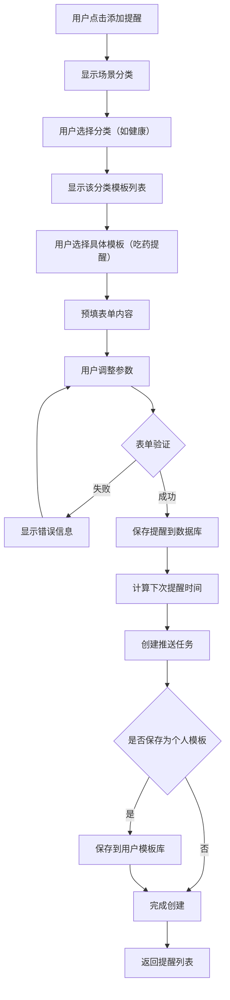

### **B. 语音输入创建**

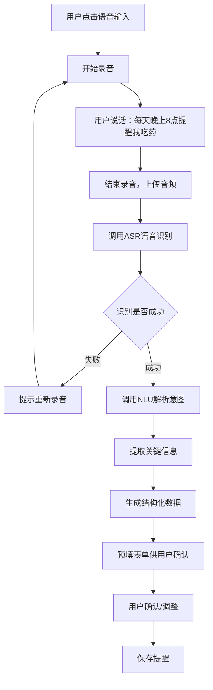

**语音解析示例：**

```json
// 用户输入："每天晚上8点提醒我吃药"
// 解析结果：
{
    "title": "吃药",
    "recurrence_type": "daily",
    "recurrence_config": {"time": "20:00"},
    "category": "health",
    "remind_advance_days": 0
}
```

**涉及数据表：**

- `reminders` - 存储提醒记录
- `reminder_templates` - 系统模板
- `user_custom_templates` - 个人模板
- `voice_inputs` - 语音输入记录
- `push_tasks` - 推送任务

---

## 📢 流程3：推送任务执行

### **推送调度流程**

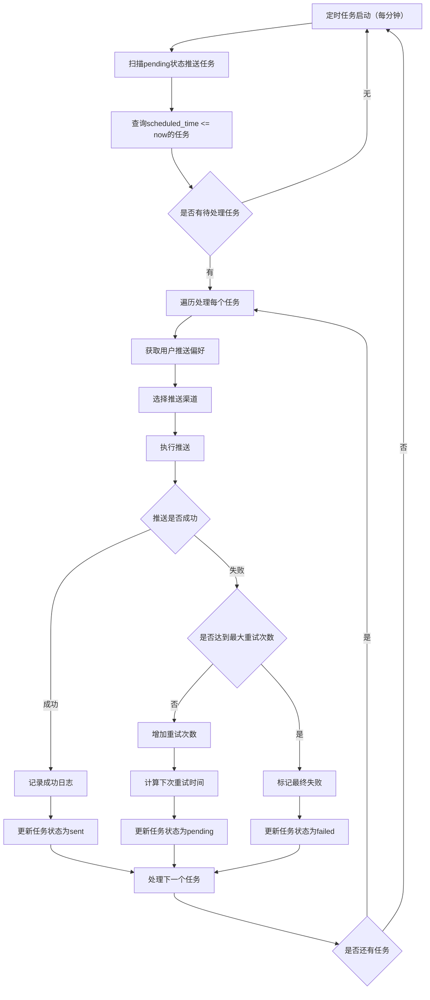

### **多渠道降级策略**

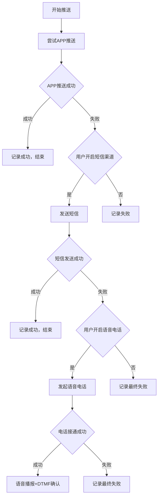

**涉及数据表：**

- `push_tasks` - 推送任务状态管理
- `push_logs` - 详细推送日志
- `user_behaviors` - 用户响应行为分析

---

## 👨‍👩‍👧‍👦 流程4：家庭共享功能

### **A. 创建家庭组流程**

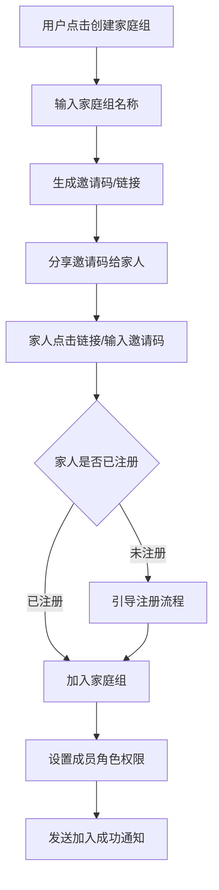

### **B. 老年关怀场景（重要）**

```mermaid
flowchart TD
    A[子女创建家庭组] --> B[邀请父母加入]
    B --> C[父母接受邀请]
    C --> D[子女创建共享提醒：爸爸吃药]
    D --> E[设置提醒参数]
    E --> F[指定负责人：爸爸]
    F --> G[启用多重通知机制]
    G --> H[每日20:00 - 系统推送给爸爸]
    H --> I{爸爸是否及时响应}
    I -->|按时确认| J[记录完成状态]
    I -->|延迟确认| K[记录延迟状态]
    I -->|30分钟未响应| L[自动通知子女]
    J --> M[发送完成通知给子女]
    K --> N[发送延迟通知给子女]
    L --> O[子女收到"爸爸可能忘记吃药"提醒]
    M --> P[更新下次提醒时间]
    N --> P
    O --> Q[子女可主动联系或家访]
```

### **C. 权限管理逻辑**

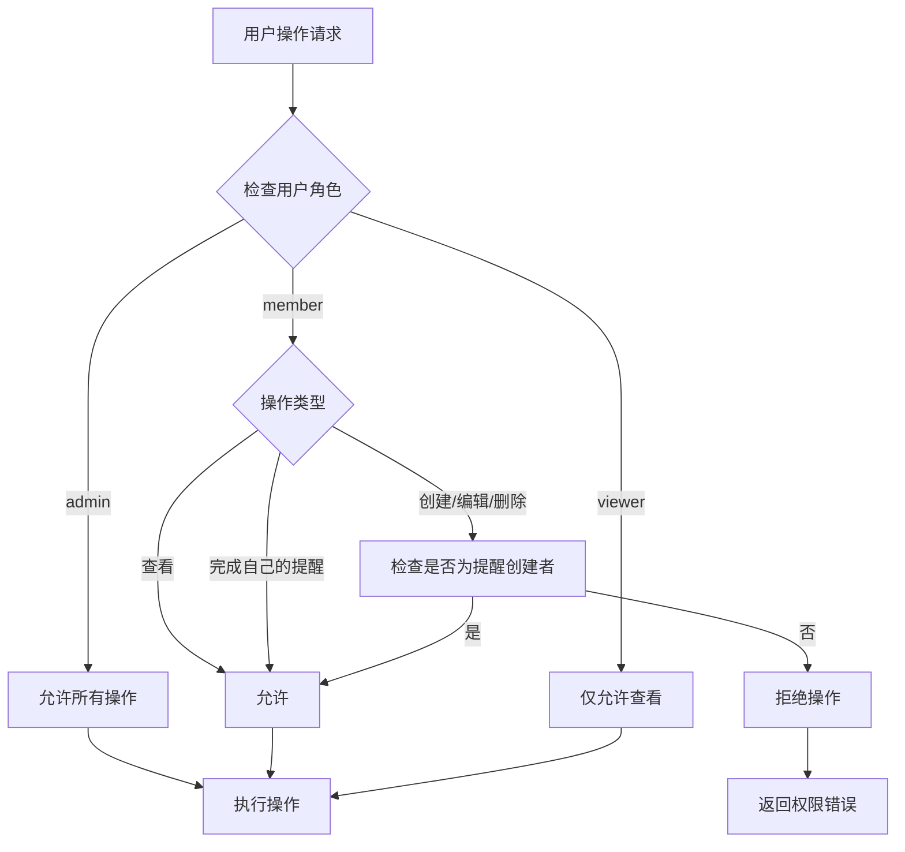

**涉及数据表：**

- `family_groups` - 家庭组信息
- `family_members` - 成员关系和权限
- `reminders` - 共享提醒（family_group_id不为空）
- `push_tasks` - 多人推送任务
- `reminder_completions` - 完成记录

---

## 📤 流程5：模板分享生态

### **A. 分享模板流程**

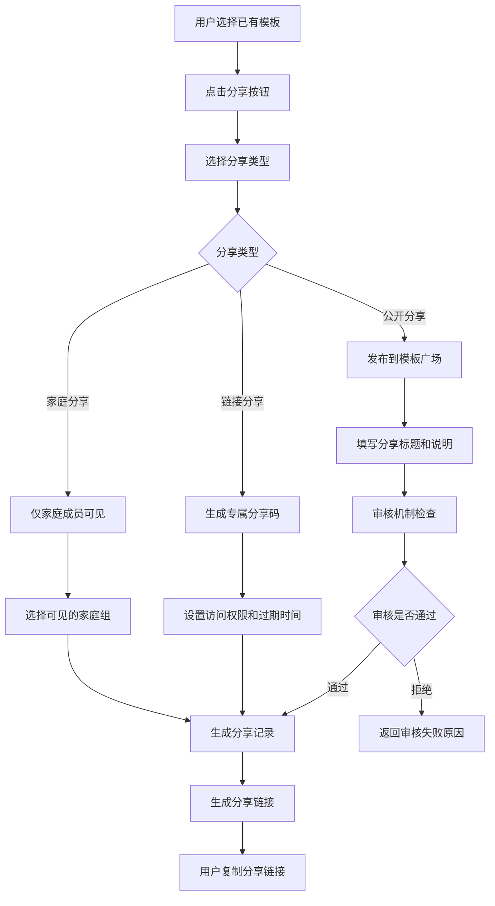

### **B. 使用他人模板流程**

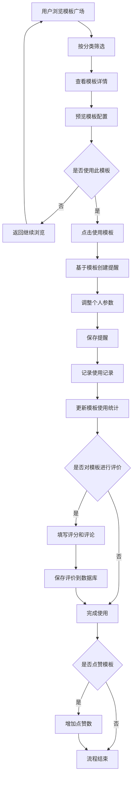

### **C. 模板推荐算法**

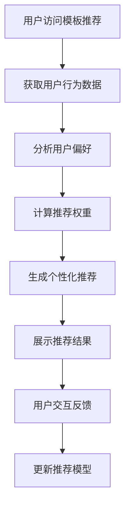

**推荐算法因子：**

- 用户已有提醒分类偏好
- 相似用户的使用模板
- 模板热度和评分
- 季节性因素（如年底体检）
- 地域性因素（如南方北方差异）

**涉及数据表：**

- `template_shares` - 分享记录
- `template_usage_records` - 使用记录
- `template_likes` - 点赞记录
- `user_custom_templates` - 个人模板

---

## 📊 流程6：数据统计与分析

### **A. 个人数据统计流程**

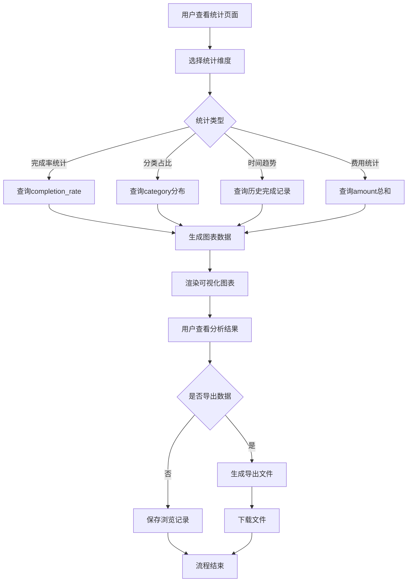

### **B. 智能洞察生成流程**

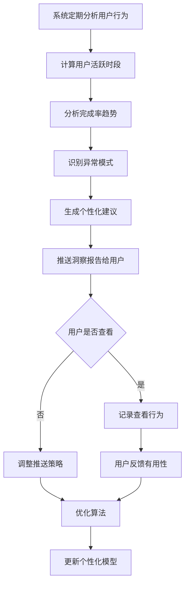

**智能洞察示例：**

- "您通常在早上8-9点确认提醒，建议将重要提醒调整到这个时段"
- "最近3次房租提醒都延迟了，建议提前2天提醒"
- "您的健康类提醒完成率95%，继续保持！"
- "发现您经常在周末忘记提醒，建议开启强提醒模式"

**涉及数据表：**

- `user_behaviors` - 行为分析数据
- `reminder_completions` - 完成统计
- `personal_insights` - 个性化洞察记录

---

## 🔄 流程7：周期计算引擎

### **复杂周期计算流程**

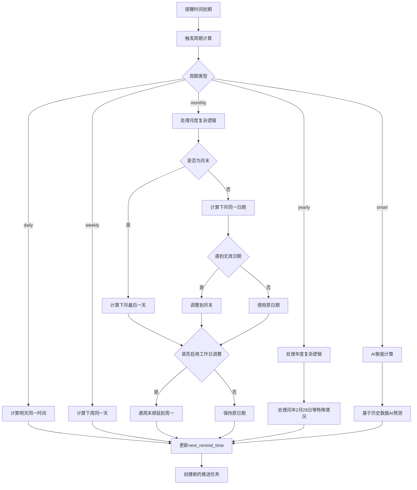

### **智能周期示例**

用户说："大概每3个月去看一次牙医"

```json
{
    "recurrence_type": "smart",
    "recurrence_config": {
        "base_months": 3,
        "flexibility_days": 14,
        "learning_enabled": true
    }
}
```

AI根据用户历史行为，可能会在85-95天之间智能提醒。

**涉及数据表：**

- `reminders` - 存储周期配置
- `reminder_completions` - 历史完成数据用于AI学习
- `holiday_calendar` - 节假日日历
- `user_behaviors` - 用户偏好时间

---

## 🎯 异常处理流程

### **A. 推送失败处理**

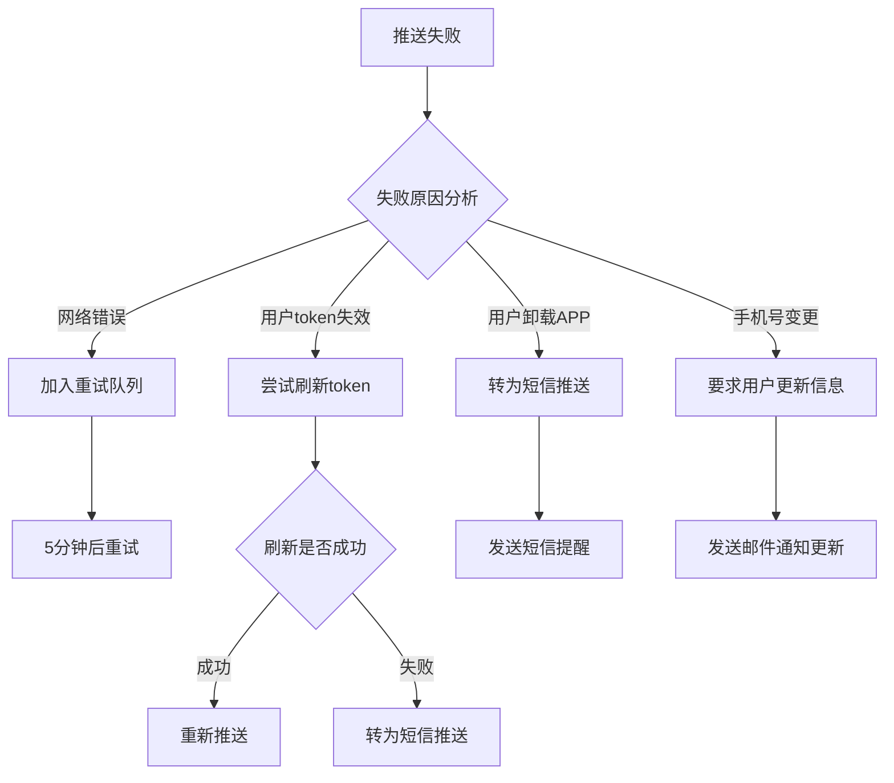

### **B. 数据一致性保障**

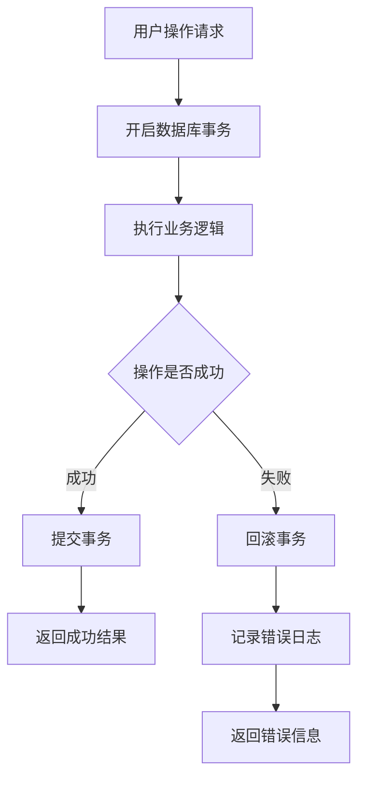

### **C. 系统性能监控**

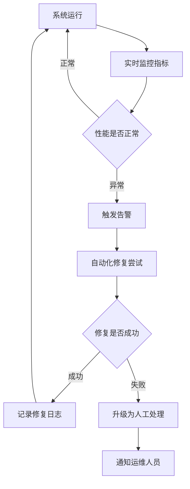

---

## 🔍 业务流程检查清单

### **核心功能完整性检查**

- ✅ 用户注册登录流程
- ✅ 提醒创建流程（模板+自定义+语音）
- ✅ 周期计算引擎（包括复杂周期）
- ✅ 推送执行流程（多渠道+重试+降级）
- ✅ 提醒完成确认流程
- ✅ 家庭共享流程（特别是老年关怀）
- ✅ 模板分享生态流程
- ✅ 数据统计分析流程
- ✅ 异常处理机制

### **用户体验流程检查**

- ✅ 新用户引导流程
- ✅ 首次创建提醒引导
- ✅ 推送失败的用户感知
- ✅ 家庭成员操作权限清晰
- ✅ 模板发现和使用便捷
- ✅ 数据洞察有价值

### **技术架构流程检查**

- ✅ 数据一致性保障
- ✅ 并发操作处理
- ✅ 性能监控告警
- ✅ 故障自动恢复
- ✅ 数据备份恢复

### **业务规则检查**

- ✅ 权限控制逻辑
- ✅ 免费版功能限制
- ✅ 会员升级触发
- ✅ 内容审核机制
- ✅ 隐私保护流程

---

## 🎯 重要业务场景验证

### **场景1：老年关怀（已验证）**

子女为父母设置吃药提醒，父母未响应时通知子女 ✅

### **场景2：租房族管理**

每月25号房租，遇周末顺延，金额记录，完成后自动计算下月 ✅

### **场景3：宠物护理**

复杂的疫苗、驱虫、洗澡周期管理，不同周期互不冲突 ✅

### **场景4：模板病毒传播**

优质模板通过分享快速传播，形成用户增长飞轮 ✅

### **场景5：智能优化**

基于用户行为自动优化提醒时间和方式 ✅

---

## 💡 潜在优化点

### **A. 流程优化建议**

1. **语音输入优化**：增加方言识别支持
2. **推送智能化**：基于用户位置的智能推送时间
3. **家庭协作增强**：增加任务分配和进度追踪
4. **模板质量提升**：AI辅助生成更精准的模板

### **B. 性能优化点**

1. **推送并发优化**：高峰期推送任务批处理
2. **数据查询优化**：复杂统计查询的缓存机制
3. **存储优化**：历史数据分层存储策略

### **C. 用户体验优化**

1. **离线支持**：本地缓存重要提醒数据
2. **多设备同步**：实时同步用户操作状态
3. **个性化推荐**：更精准的模板和设置推荐

---

## ✅ 结论

**业务流程完整性**：✅ 已覆盖所有核心业务场景

**数据流转清晰**：✅ 每个流程都有明确的数据库操作

**异常处理完善**：✅ 关键节点都有容错机制

**用户体验考虑**：✅ 从新手到专家的完整用户旅程

**技术实现可行**：✅ 所有流程都基于现有数据库设计

**这套业务流程设计可以支撑产品从MVP到成熟阶段的所有核心功能需求！** 🚀